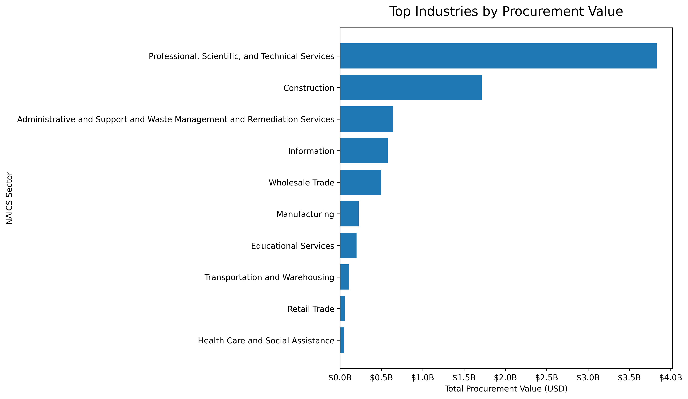
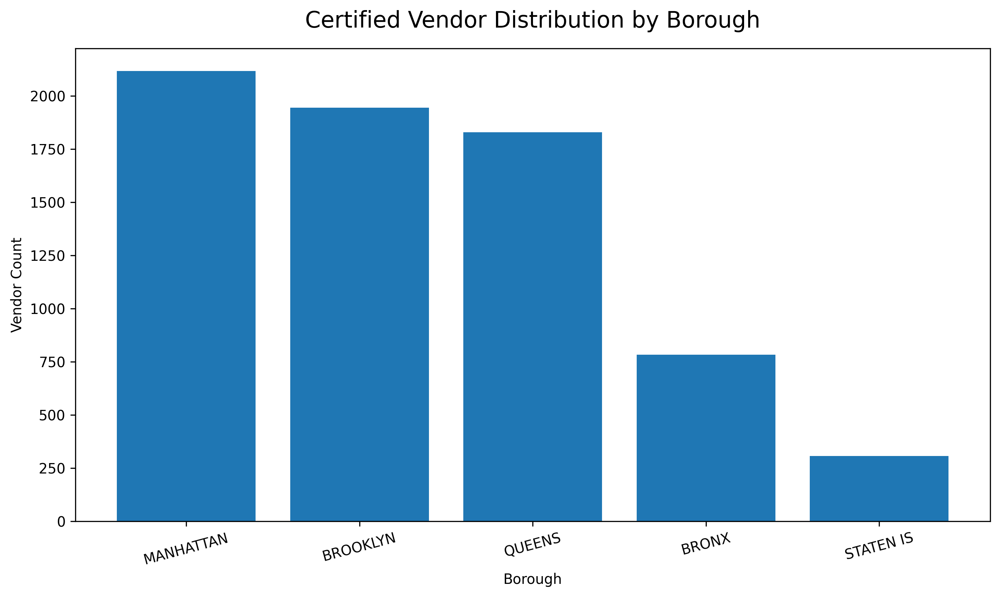
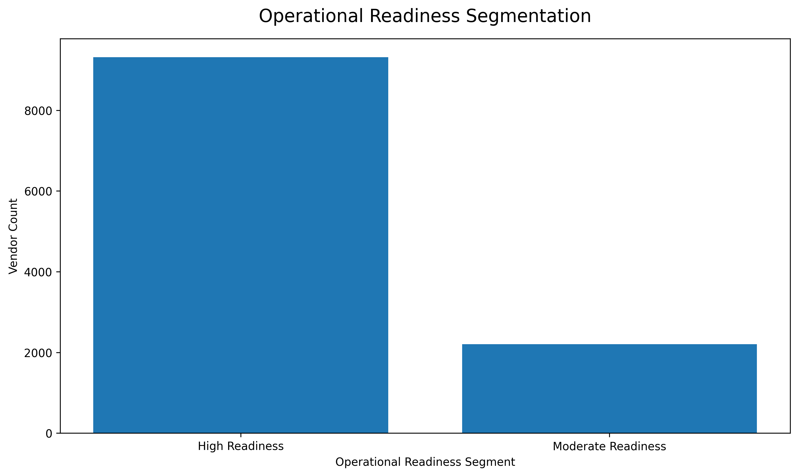
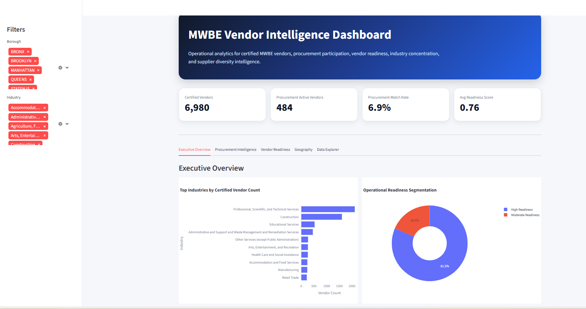

# MWBE Vendor Intelligence & Procurement Analytics

## Project Overview

This project analyzes publicly available NYC MWBE certification and procurement award data to build an operational vendor intelligence framework using:

- data engineering
- feature engineering
- operational analytics
- procurement enrichment
- geospatial readiness analysis
- exploratory data analysis (EDA)

The project demonstrates how open public-sector datasets can be transformed into actionable procurement and vendor intelligence workflows.

---

# Business Problem

Modern supplier diversity ecosystems require more than static vendor directories.

This project explores how operational analytics can help answer questions such as:

- Which certified firms actively participate in procurement activity?
- Which industries demonstrate the highest procurement engagement?
- Which vendors appear operationally mature but underutilized?
- Which firms demonstrate strong operational readiness?
- Where are certified vendors geographically concentrated?

The project simulates workflows relevant to:
- certification platforms
- procurement analytics
- vendor intelligence systems
- supplier diversity operations

---

# Data Sources

## 1. NYC SBS Certified Business List

Source:
- NYC Department of Small Business Services (SBS)
- NYC Open Data

Contains:
- MWBE certification data
- vendor profiles
- NAICS classifications
- project experience
- operational metadata
- geographic attributes

---

## 2. NYC Procurement Contract Awards

Source:
- NYC Open Data — Recent Contract Awards

Contains:
- procurement award activity
- vendor participation
- contract values
- agency procurement records
- procurement timelines

---

# Project Structure

```text
mwbe-analytics/
├── data/
│   ├── raw/
│   │   ├── nyc_mwbe_certified_businesses.csv
│   │   └── nyc_recent_contract_awards_raw.csv
│   └── processed/
│       ├── mwbe_vendor_intelligence.csv
│       ├── mwbe_vendor_intelligence_enriched.csv
│       ├── nyc_recent_contract_awards_clean.csv
│       └── vendor_procurement_features.csv
│
├── notebooks/
│   ├── mwbe_certification_ingestion.ipynb
│   ├── procurement_contract_awards_ingestion.ipynb
│   └── eda_vendor_intelligence.ipynb
│
├── src/
│   ├── load/
│   │   └── load_to_duckdb.py
│   ├── transform/
│   └── sql/
│       ├── borough_vendor_distribution.sql
│       ├── digital_readiness_analysis.sql
│       ├── high_readiness_low_activity_vendors.sql
│       ├── industry_readiness_segmentation.sql
│       ├── procurement_agency_diversification.sql
│       ├── procurement_participation_analysis.sql
│       ├── renewal_urgency_analysis.sql
│       ├── top_industries_by_procurement.sql
│       ├── top_procurement_vendors.sql
│       ├── top_vendor_capacity.sql
│       └── vendor_readiness_summary.sql
│
├── database/
│   └── mwbe_vendor_intelligence.duckdb
│
├── dashboard/
│   ├── app.py
│   └── assets/
│       ├── borough_procurement_value.png
│       ├── borough_vendor_distribution.png
│       ├── missing_data_analysis.png
│       ├── operational_readiness_distribution.png
│       ├── procurement_participation.png
│       ├── top_industries_by_procurement_value.png
│       └── vendor_capacity_distribution.png
│
├── requirements.txt
└── README.md
```


---

# Key Analytics Workflows

## Data Cleaning & Standardization

The project includes:
- column normalization
- malformed date handling
- numeric field cleaning
- operational null handling
- vendor name standardization
- geospatial cleanup

---

## Feature Engineering

Several operational intelligence features were engineered, including:

### Certification & Lifecycle Features
- renewal_year
- months_until_renewal
- renewal_urgency
- missing_renewal_date

### Operational Readiness Features
- profile_completeness_score
- profile_completeness_pct
- operational_readiness_score
- operational_readiness_segment

### Vendor Capacity Features
- years_in_business
- project_experience_count
- contract_capacity_segment
- vendor_capacity_score

### Digital Readiness Features
- has_website
- passport_enrolled_flag
- digital_readiness_score

### Procurement Features
- procurement_contract_count
- total_procurement_value
- procurement_activity_score
- agency_count
- years_since_last_award

### Geographic Features
- borough_clean
- has_geocode

---

# Procurement Enrichment

The procurement dataset was merged with the certified vendor dataset using standardized vendor names through an entity resolution workflow.

This enrichment process transformed the project from: directory analytics

into:vendor intelligence and procurement participation analytics


---

# Key Insights

## Procurement Participation

Approximately: 7.75% of certified firms appeared in procurement award activity.

Potential explanations include:
- procurement participation gaps
- inactive certified vendors
- procurement dataset scope limitations
- vendor naming inconsistencies

---

## Operational Readiness

Feature engineering revealed significant variation in:
- profile completeness
- digital readiness
- operational maturity
- procurement engagement

---

## Industry & Geographic Analysis

The project identified:
- industry procurement concentration patterns
- borough-level vendor distribution
- operational readiness segmentation
- procurement participation disparities

---

# Technologies Used

- Python
- Pandas
- NumPy
- Matplotlib
- Plotly
- DuckDB
- SQL
- Jupyter Notebook
- Streamlit

---

# Dashboard

A Streamlit dashboard was developed to visualize:
- vendor readiness
- procurement participation
- geographic concentration
- operational segmentation
- procurement activity

---

# Sample Visualizations

## Top Industries by Procurement Value



---

## Borough Vendor Distribution



---

## Operational Readiness Segmentation



---
---

## Dashboard Preview



---
# DuckDB & SQL Analytics

The processed datasets were loaded into DuckDB to support:
- SQL analytics
- vendor segmentation queries
- procurement aggregations
- operational intelligence workflows

---

# Future Improvements

Potential future enhancements include:
- fuzzy entity matching
- geospatial clustering
- procurement forecasting
- vendor similarity analysis
- recommendation systems
- advanced dashboarding
- machine learning segmentation

---

# Key Skills Demonstrated

This project demonstrates:

- Data Engineering
- Feature Engineering
- Operational Analytics
- Procurement Intelligence
- Entity Resolution
- Data Cleaning
- Geospatial Readiness Analysis
- SQL Analytics
- Dashboard Development
- Exploratory Data Analysis (EDA)

---

# Author

Sena Kaledzi

Project developed as part of a public-sector analytics and data engineering portfolio focused on supplier diversity and operational intelligence systems.